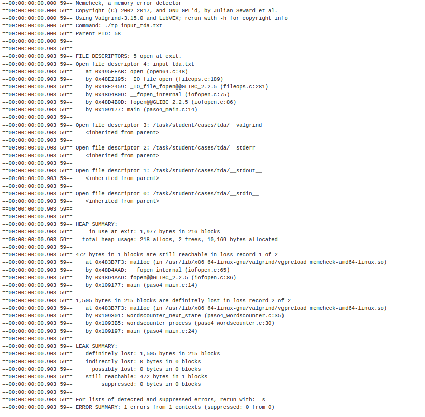
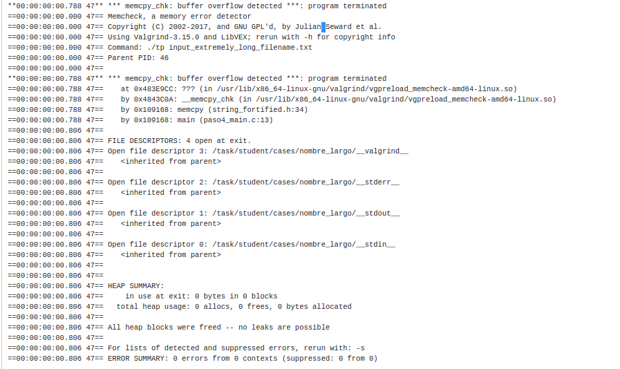
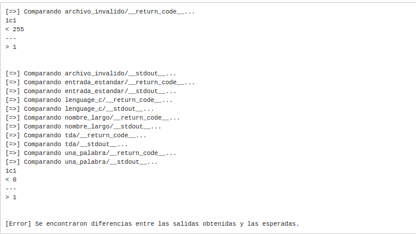
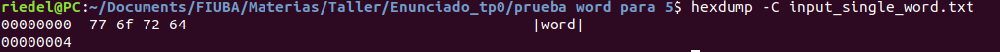
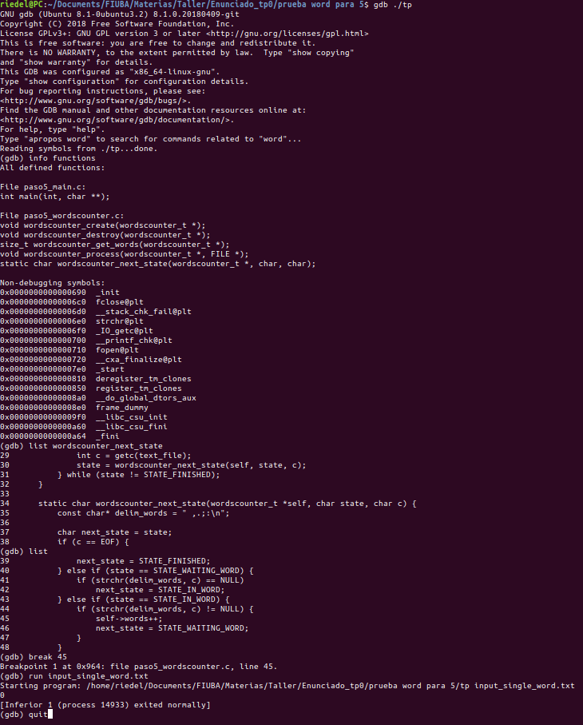
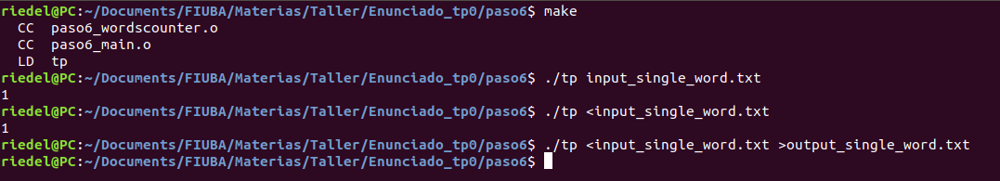

# Ejercicio Nº 0 - Contador de Palabras

## Nicolás Riedel (102130)

## Link al repo : https://github.com/RiedelNicolas/Taller_Veiga_tp0 .

### Taller de Programación I (75.42) - Cátedra Veiga - UBA


## Pasos

### Paso 0: Entorno de Trabajo

1. #### Capturas de pantalla de la ejecución del aplicativo (con y sin **_Valgrind_**)

   ​		Sin **_Valgrind_** :

   

   ​		 Con **_Valgrind_** :

   

   

2. #### ¿Para qué sirve **_Valgrind_**? ¿Cuáles son sus opciones más comunes?

   **_Valgrind_** es una herramienta que nos permite visualizar como maneja la memoria nuestro programa.  

   Sus usos mas comunes son:

    * *--leak-check=full* 

      ​	Encuentra **leaks** (o "perdidas" de memoria).

    * *--track-origins=yes*

      ​	Para encontrar variables sin inicializar .(Lo que puede llevar a errores de memoria)

    * *--show-reachable=yes*

      ​	Muestra todos los bloques de memoria referenciados,  nos alerta si se perdió la referencia a alguno.

3. #### ¿Qué representa **sizeof()**? ¿Cuál sería el valor de salida de **sizeof(char)** y **sizeof(int)**?

   **sizeof()** es una función estándar de **C** que recibe una variable/tipo de dato y devuelve el tamaño en bytes que ocupa en memoria. La salida de **sizeof(char)** y **sizeof(int)**  representa el tamaño de un **char** o un **int** en la arquitectura que estemos trabajando. En la mayoría de los entornos actuales un **char** tiene un tamaño de **1 byte** y un entero de **4**.

4. #### ¿El **sizeof()** de una **struct** de **C** es igual a la suma del **sizeof()** de cada uno sus elementos? Justifique mediante un ejemplo

​	No necesariamente. El compilador por defecto guarda las variables en posiciones múltiplos de 4, entonces si guardamos un **struct** compuesto por un **entero** 	seguido de un **char**, este en memoria tendrá un sector de **_padding_** para que la próxima variable quede alineada en memoria. 

​	Código de ejemplo :

```c
#include <stdio.h>
struct S {
	int a;
    char b;
};

int main(){
	printf("El tam de un entero es: %zu \n",sizeof(int));
	printf("El tam de un char es: %zu \n",sizeof(char));
	printf("El tam del struct conformado por ambos es: %zu \n",sizeof(struct S) );
	return 0;
}
```


​	y la salida del programa es: 

​	

​	Con esto podemos observar que se agregan 3 bytes de **padding** para que el **struct** quede alineado en memoria. 

5. #### Investigar la existencia de los archivos estándar: **STDIN**, **STDOUT**, STDERR. Explicar brevemente su uso y cómo redirigirlos en caso de ser necesario (caracteres > y <) y como conectar la salida estándar de un proceso a la entrada estándar de otro con un pipe (carácter | ).                                                             

   Son los **streams** de texto estándar para todo sistema basado en **UNIX**.

    * **STDIN** : Es usado para **entrada** de datos.
   * **STDOUT** : Es usado para **salida** de datos.
   * **STDERR** : Es usado para mostrar mensajes de **error**.

   Estos pueden ser redirigidos con los caracteres '**>**' y '**<**' .

   Por ejemplo si queremos redirigir la salida de nuestro primer ejemplo a un archivo de texto basta con ejecutar el programa como:

    `./tp 1 > salida.txt`

   y el "Hola mundo" sera impreso en el archivo de texto en lugar de **STDOUT**.

   Ahora si en lugar de redirigir **STDOUT** queremos redirigir el **STDERR** tenemos que ejecutar.

    `./tp 2> error.txt`

   y si queremos hacerlo con ambos streams debemos

    `./tp 1> salida.txt 2>error.txt`

   (siendo **1** el indicador de **STOUT** y **2** el de **STDERR**)

   Análogamente si queremos hacer algo similar con la entrada tendremos que ejecutar : 

    `./tp 1 < entrada.txt`

   En lo que respecta a conectar la salida estándar de un proceso con la entrada estándar de otro, esto se realiza mediante un **pipe**. 

   Digamos que queremos capturar la salida de nuestro primer ejemplo ("Hola mundo") con la entrada estándar de otro. 

   `./tp | ./lector  `

   En este caso "lector" recibirá por **STDIN** la salida de "tp". 


### Paso 1:  SERCOM - Errores de generación y normas de programación

1. #### Captura de pantalla mostrando los problemas de estilo detectados. Explicar cada uno

   

   

   ##### Explicación de cada uno :

   * ```bash
     paso1_wordscounter.c:27:  Missing space before ( in while(  [whitespace/parens] [5]
     ```

     ##### Según la convención fijada, debe haber un espacio antes del paracentesis que contiene la condición del *while*.

   * ```bash
     paso1_wordscounter.c:41:  Mismatching spaces inside () in if  [whitespace/parens] [5]
     ```

     ##### La condición del *if* arranca con un espacio, esto tendría que ser simétrico y también debería haber un espacio antes del paréntesis que cierra.

   * ```bash
     paso1_wordscounter.c:41:  Should have zero or one spaces inside ( and ) in if  [whitespace/parens] [5]
     ```

     ##### La condición del *if* en tal linea se abre con dos espacios, el limite es uno. 

   * ```bash
     paso1_wordscounter.c:47:  An else should appear on the same line as the preceding }  [whitespace/newline] [4]
     ```

   #####        Luego de cerrar el bloque correspondiente a un *IF* previo, el *ELSE* subsiguiente debe estar en la misma linea.

   * ```bash
     paso1_wordscounter.c:47:  If an else has a brace on one side, it should have it on both  [readability/braces] [5]
     ```

     ##### Así como se cierra el bloque anterior, se debe abrir el nuevo en esa misma linea.

   * ```bash
     /paso1_wordscounter.c:48:  Missing space before ( in if(  [whitespace/parens] [5]
     ```

     ##### Al igual que en el *while* previo, debe haber un espacio antes de la condición. 

   * ```bash
     /paso1_wordscounter.c:53:  Extra space before last semicolon. If this should be an empty statement, use {} instead.  [whitespace/semicolon] [5]
     ```

     ##### No debe haber un espacio antes de los *";"*

   * ```bash
     /paso1_wordscounter.h:5:  Lines should be <= 80 characters long  [whitespace/line_length] [2]
     ```

     ##### Las lineas deben tener menos de *80 caracteres*.(En este caso el comentario la supera)

   * ```bash
     /paso1_main.c:12:  Almost always, snprintf is better than strcpy  [runtime/printf] [4]
     ```

     ##### *strcpy* como vimos en clase puede ser muy insegura, por otro lado *snprintf* es mucho mas *robusta*.

   * ```bash
     /paso1_main.c:15:  An else should appear on the same line as the preceding }  [whitespace/newline] [4]
     ```

     ##### Idéntico a un error previo, el *else* debe estar en la misma linea que se cierra el bloque anterior.

   * ```bash
     /paso1_main.c:15:  If an else has a brace on one side, it should have it on both  [readability/braces] [5]
     ```

     ##### Se debe abrir el nuevo bloque en la misma linea.

2.  #### Captura de pantalla indicando los errores de generación del ejecutable. Explicar cada uno e indicar si se trata de errores del *compilador* o del *linker*.

   

   * ```bash
     paso1_main.c:22:9: error: unknown type name ‘wordscounter_t’
     ```

     ##### No esta definido el *struct* ‘*wordscounter_t*’, esto es debido a que no se importo la *biblioteca* requerida.  
     
   * ```bash
     paso1_main.c:23:9: error: implicit declaration of function ‘wordscounter_create’ [-Wimplicit-function-declaration]
     ```
     
     ##### No esta definida la función, por la misma razón.  
   * ```bash
     paso1_main.c:24:9: error: implicit declaration of function ‘wordscounter_process’ [-Wimplicit-function-declaration]
     ```
     
     ##### Idem.
   * ```bash
       paso1_main.c:25:24: error: implicit declaration of function ‘wordscounter_get_words’ [-Wimplicit-function-declaration]
     ```
     
     ##### Idem.
   * ```bash
     paso1_main.c:27:9: error: implicit declaration of function ‘wordscounter_destroy’ [-Wimplicit-function-declaration]
     ```
     
     ##### Idem.
   
   Todos estos son errores de **compilación**, ya que se fallo en crear el **código objeto** como bien lo indica la salida del **SERCOM** al final de la captura.
   
3.  #### ¿El sistema reportó algún *WARNING*? ¿Por qué?

     La respuesta es no. Inspeccionando el **MAKEFILE** que se encuentra en el **SERCOM** se puede observar que se esta compilando el programa con **-Werror** donde este **flag** no hace otra cosa mas que tratar a los **warnings** como **errores**. Sin este comando los últimos 4 **errores** solo serian **warnings**.

### Paso 2: SERCOM - Errores de generación 2

1. #### Describa en breves palabras las correcciones realizadas respecto de la versión anterior.

    ##### Respecto a lo que se pudo visualizar del uso del comando ***diff*** se observo :

   * Cambios en el **código** que permiten pasar las normas de programación satisfactoriamente.
   * Se incluye el **header** de la biblioteca "**paso2_wordscounter.h**", lo que **resuelve** los **problemas** de **compilación** previos (no descarta que aparezcan nuevos )
   * Se cambia brevemente la descripción del **struct**.

2. #### Captura de pantalla indicando la correcta *ejecución* de verificación de *normas* *de* *programación*

   

3. #### Captura de pantalla indicando los errores de generación del *ejecutable*. Explicar cada uno e indicar si se trata de *errores* del *compilador* o del *linker*.

   

    			

   

   ​			Nuevamente se puede observar que no se llego a la etapa de **linkeo**,  al fallar la creación del código objeto todos los **errores**  vuelven a ser de      			**compilación**.

   ​		Los errores puntuales son : 

   * ```bash
     paso2_wordscounter.h:7:5: error: unknown type name ‘size_t’
     ```

     ​	No esta definido **size_t** , esto es porque **no se incluyo la biblioteca estándar** donde esta definido.

   * ```
     paso2_wordscounter.h:20:1: error: unknown type name ‘size_t’
     ```

     ​	Misma razón. 

   * ```bash
     paso2_wordscounter.h:25:49: error: unknown type name ‘FILE’
     ```
     
     Similar a los errores previos, no se incluyo el **header** donde esta definido **FILE**. 
   * ```bash
       paso2_wordscounter.c:17:8: error: conflicting types for ‘wordscounter_get_words’
     ```
     
     Viendo el código se ve que en ambos lugares la firma de la función esta definida de igual manera, lo que me hace entender que el error se genera porque **size_t** (el tipo de dato que devuelve) **no esta definido** en uno de los archivos. 
   * ```bash
     paso2_wordscounter.c:30:25: error: implicit declaration of function ‘malloc’ [-Wimplicit-function-declaration]
     ```

     **No se incluye** la **biblioteca** donde esta definido **malloc**.

### Paso 3: SERCOM - Errores de generación 3

 1. #### Describa en breves palabras las correcciones realizadas respecto de la versión anterior.

    ##### Por la utilización del comando ***diff*** se puede observar : 

    * Se incluye la **biblioteca** <**stdlib.h**> en el archivo paso3_wordscounter.c
    * Se incluyen <**string.h**> y <**stdio.h**> en el archivo paso3_wordscounter.h

 2. ####  Captura de pantalla indicando los errores de generación del ejecutable. Explicar cada uno e indicar si se trata de errores del *compilador* o del *linker* .

    

    Como se puede observar en la captura hay un solo error, y este corresponde al **linker** ya que como se puede observar en la salida del **SERCOM** los

     archivos **objeto** fueron generados correctamente. El problema en **linkeo** se debe a que en el **main** se utiliza la función **wordscounter_destroy()** que esta 

    declarada en el **header** pero nunca se implementa en el archivo **.c** correspondiente, por lo tanto la generación del ejecutable **falla en etapa de linkeo**. 

###  Paso 4: SERCOM - Memory Leaks y Buffer Overflows

1. #### Describa en breves palabras las correcciones realizadas respecto de la versión anterior.

   ##### Nuevamente por la utilización del comando *diff* se observa:

    * Se implementa la función **wordscounter_destroy()**  para salvar el error previo. 

 2. #### Captura de pantalla del resultado de ejecución con *Valgrind* de la prueba ‘*TDA*’. Describir los errores reportados por *Valgrind*

    

    ​			

    ​		 En esta prueba tenemos 2 errores.

      * ```bash
        472 bytes in 1 blocks are still reachable in loss record 1 of 2
        ```

        ​	Este error significa que **reservamos memoria pero no liberamos** antes de finalizar la ejecución del programa. (En este caso hacemos un **fopen()** sin hacer el correspondiente **fclose()** ).

    * ```bash
      1,505 bytes in 215 blocks are definitely lost in loss record 2 of 2
      ```

      ​	En este segundo caso también **reservamos memoria y no la liberamos**, pero con la diferencia que ademas **perdimos la referencia** a dicha memoria. Esto hace que la memoria sea imposible de liberar. (En este caso la función **wordscounter_next_state()** realiza un **malloc** y luego esa **memoria** nunca  se libera, perdiendo la **referencia** cuando se cierra el **scope** de dicha función)

3. ####  Captura de pantalla del resultado de ejecución con *Valgrind* de la prueba ‘*Long Filename’*. Describir los errores reportados por *Valgrind*.!

   ​	

   * ```bash
     memcpy_chk: buffer overflow detected ***: program terminated
     ```

     En este caso el error es **buffer overflow,** generado en un llamado a la función **memcpy**. Esto es generado debido a que el array **char filepath[30];** esta definido con un largo de **30 bytes** y en esta prueba se intenta guardar una cadena de tamaño mayor, lo que genera un **buffer overflow.**

4. #### ¿Podría solucionarse este error utilizando la función strncpy? ¿Qué hubiera ocurrido con la ejecución de la prueba?

   En el caso de haber usado la función **strncpy** en lugar de **memcpy** se hubiera prevenido el **overflow**, esto es debido a que **strncpy** es una función mas segura que recibe en forma de **size_t** la cantidad máxima de bytes que se pueden copiar y **nunca supera** ese numero. 

   Si en esta prueba se utiliza **strncpy** en lugar de de **memcpy**, esta no arroja el **buffer overflow** pero queda el **string** destino incompleto, ya que la fuente es de mayor tamaño que el lugar que tiene asignado. Por obvias razones esto es preferible a tener un **buffer overflow**.

5. #### Explicar de qué se trata un *segmentation fault* y un *buffer overflow*.

   * **Segmentation fault** : Ocurre cuando nuestro programa intenta acceder a una dirección de memoria que no se tiene permisos. 
   * **Buffer overflow** : Esto ocurre cuando nuestro programa tiene que copiar valores sobre un área de memoria (en nuestro caso un **array**) y se excede de la misma también copiando los datos sobre las direcciones adyacente. Esto puede ser peligroso, no solo en términos del funcionamiento del software sino también en términos de seguridad.

### Paso 5: SERCOM - Código de retorno y salida estándar

1. #### Describa en breves palabras las correcciones realizadas respecto de la versión anterior.

   ##### 	Nuevamente corremos el comando ***diff*** :

   		* Se agrega el **fclose** necesario para cerrar el archivo que generaba errores de **valgrind** previamente.
   		* En lugar de cargar el argumento recibido por comando en un **string** se usa directamente como **path** para **fopen**, solucionando el error de **buffer** **overflow**.

  2. #### Describa el motivo por el que fallan las prueba ‘Invalid File’ y ‘Single Word’. ¿Qué información entrega SERCOM para identificar el error? Realice una captura de pantalla.

     

     Las pruebas fallan porque en el primer caso el retorno es distinto al esperado y en el segundo la salida es distinta a la esperada, **SERCOM** nos indica cual es el resultado obtenido y cual el esperado. 

3. #### Captura de pantalla de la ejecución del comando *hexdump*. ¿Cuál es el último carácter del archivo *input_single_word*.*txt*?

   

   Observando el **dump** se puede ver que el ultimo carácter del archivo es '**d**', realmente yo me esperaba encontrar con un **EOF** pero luego de una breve investigación aprendí que **EOF** es una abstracción y no un carácter en si. 

4. #### Captura de pantalla con el resultado de la ejecución con *GDB*. Explique brevemente los comandos utilizados en *GDB*. ¿Por qué motivo el *debugger* no se detuvo en el ***breakpoint*** de la línea 45: *self->words++; ?*

   

   ##### Los comandos usandos fueron :

   * **info functions** : Imprime la **firma** de todas las funciones que se encuentran declaradas en el programa.
   * **list wordscounter_next_state** :  Nos muestra donde es llamada y el principio de la implementación de la función que recibe por parámetro (en este caso **wordscounter_next_state** )
   * **list** : Imprime codigo, continua imprimiendo donde paro el **list** anterior. En este caso nos termina de mostrar la implementación de la función **wordscounter_next_state.**
   * **break 45** : Fija un **breakpoint** en la linea 45. 
   * **run input_single_word.txt** : **Ejecuta** el programa pasandole un argumento.
   * **quit**: Salimos de GDB.

   El **debugger** no se detuvo en la linea 45 porque la ejecución de dicha linea depende de la condición de un **if**, y en el caso de prueba dicha condición no se cumple por lo tanto esta linea nunca es ejecutada. 

### Paso 6: SERCOM - Entrega exitosa

#### 	1.	Nuevamente corremos el comando *diff*:

* Se cambia el valor del **macro** "**ERROR**" de 1 a -1.
* Los caracteres que limitan las palabras pasan de ser una **constante** a estar definidos como un **macro**. 
* Se vuelve a implementar la funcion **wordscounter_next_state**.

2. #### Captura de pantalla mostrando todas las entregas realizadas, tanto exitosas como fallidas

   

   

   

3. #### Captura de pantalla mostrando la ejecución de la prueba *‘Single Word’* de forma local con las distintas variantes indicadas.

   
